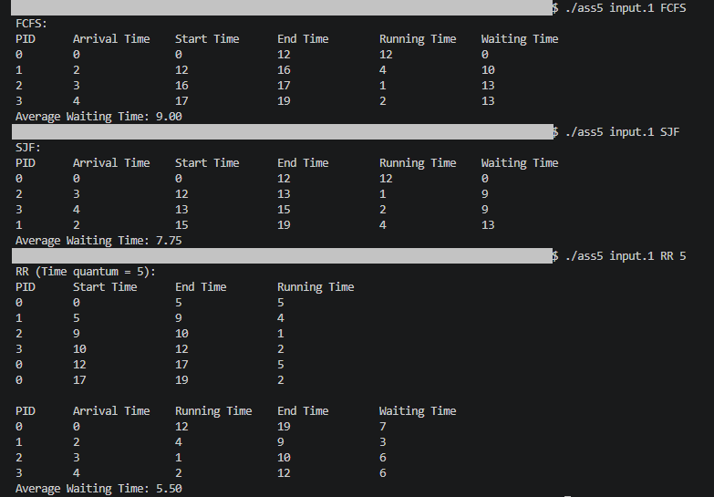
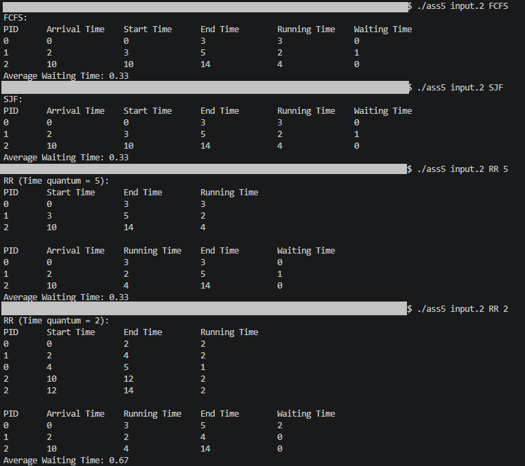
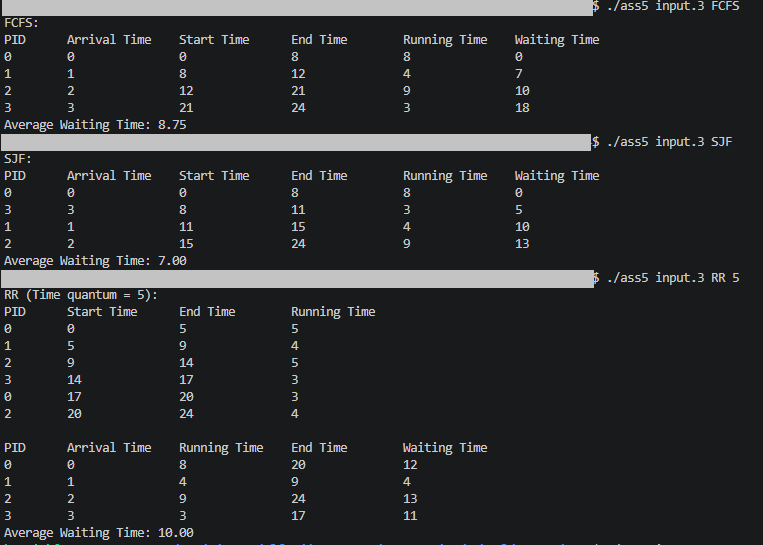

# RR-FCFS-SJK
For Assignment 5


You will first need to run this command in the folder the code is within.
    
  
  ```gcc -o ass5 ass5.c```

  
Then to run it, you do this command:
    
  
  ```./ass5 [FILE NAME] [FCFS/SJK/RR] [If RR then time quantum]```

Examples being:

  ```./ass5 input.1 FCFS```
  
  ```./ass5 input.1 SJK```
  
  ```./ass5 input.1 RR 5```

You will then get the following outputs

## Input.1
```
4
pid 	  arrival_time 	  burst_time
0 	  0 	  12
1 	  2 	  4
2 	  3 	  1
3 	  4 	  2
```

## Input.2
```
3
pid 	  arrival_time 	  burst_time
0 	  0 	  3
1 	  2 	  2
2 	  10 	  4
```

## Input.3
```
4
pid 	  arrival_time 	  burst_time
0 	  0 	  8
1 	  1 	  4
2 	  2 	  9
3 	  3 	  3
```

